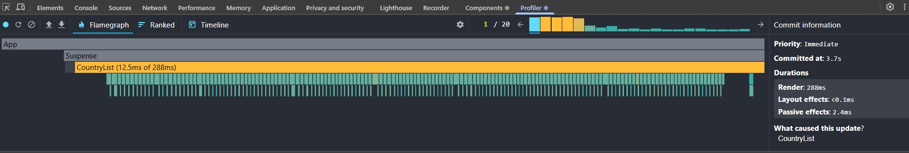
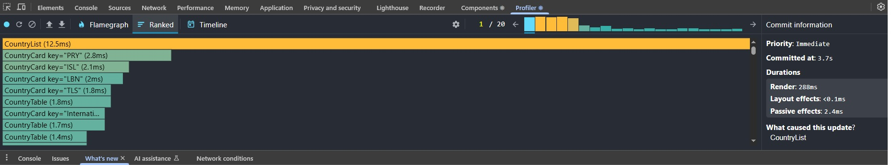
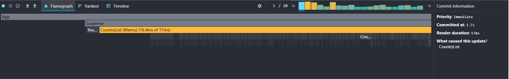
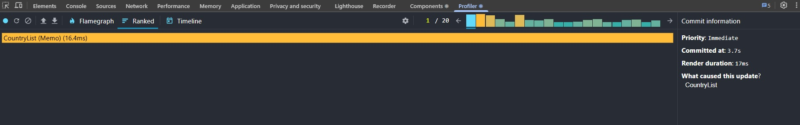

## Performance Profiling

### Initial Profiling (Before Optimization)

- **Commit Duration**: up to 55–60 ms during sorting or searching
- **Render Duration**:
  - `CountryList` ~40 ms
  - each `CountryCard` ~8–12 ms
- **Interactions**: every action (sort, search, change year) caused a full re-render of the entire list
- **Flame Graph**: most components were highlighted as expensive, especially `CountryList` and all `CountryCard`s
- **Ranked Chart**: top components were `CountryCard`, `CountryList`, and `ColumnSelectorModal`

_(Profiler screenshots “Before”)_

Flame Graph:  

Ranked Chart:  

---

### After Optimization (React.memo & useMemo)

- **Commit Duration**: 10–18 ms
- **Render Duration**:
  - `CountryList` 17–18 ms
  - individual `CountryCard` 2–4 ms
- **Interactions**: only updated cards re-rendered when filtering or searching
- **Flame Graph**: fewer expensive components, mostly `CountryList`
- **Ranked Chart**: only actually changed components appeared at the top

_(Profiler screenshots “After”)_

Flame Graph:  

Ranked Chart:  

---

### Conclusion

Using `React.memo` and `useMemo` improved performance significantly:

- Commit duration reduced by ~3x
- `CountryCard` render time reduced by ~2–3x
- Eliminated unnecessary full re-renders → now only updated data is re-rendered
